# Configure Ansible configuration repo For Jenkins Deployment

This is project is continuation from project 13.
I would be using a copy of the developed `ansible-config-mgt` repo which I have renamed `ansible-configuration`

## `Install Jenkins`

Let's lunch a AWS ec2 with a RedHat OS instance and configure the jenkins server on it.


Let's install jenkins and it's dependencies using the terminal.

```bash
sudo yum install wget -y

sudo wget -O /etc/yum.repos.d/jenkins.repo \
    https://pkg.jenkins.io/redhat-stable/jenkins.repo

sudo rpm --import https://pkg.jenkins.io/redhat-stable/jenkins.io.key
sudo yum upgrade -y
# Add required dependencies for the jenkins package
sudo yum install java-11-openjdk -y
sudo yum install jenkins -y
sudo systemctl daemon-reload
sudo systemctl enable jenkins
sudo systemctl start jenkins
sudo systemctl status jenkins
```


> Make sure to open port 8080 in the security group

Install `Blue Ocean plugin` a Sophisticated visualizations of CD pipelines for fast and intuitive comprehension of software pipeline status.


Configure blue ocean pipeline with git repo


In order for Jenkins to reconginze our repo, we need to add a Jenkinsfile. Create a `deploy` folder and add a `Jenkinsfile` to it.


Let's create a simple pipeline with one stage `build`. This has a shell command to echo a text "echo "Building Stage".

```bash
pipeline {
    agent any

  stages {
    stage('Build') {
      steps {
        script {
          sh '"echo "Building Stage"'
        }
      }
    }
    }
}
```

Now go back into the Ansible pipeline in Jenkins, and select `configure` then
Scroll down to `Build Configuration`, inside `script Path` specify the location of the Jenkinsfile at `deploy/Jenkinsfile`


Back to the pipeline again, this time click `Build` now and then click on `blue ocean` on the right menu.


Jenkins usually scan all branches to build. Let see this in action. Create a new branch `feature/jenkinspipeline-stages` and add one more stage `test`to the pipeline.


Click on `scan repository now` to build all available branches on the repository.


In `Blue Ocean`, you can now see how the Jenkinsfile has caused a new step in the pipeline launch build for the new branch.


Let's create a pull request to merge the latest code into the main branch, after merging the PR, go back into your terminal and switch into the main branch.Pull the latest change.

Create a new branch, add more stages into the Jenkins file to simulate below phases. (Just add an echo command like we have in build and test stages)

   1. Package 
   2. Deploy 
   3. Clean up

   

Verify in Blue Ocean that all the stages are working, then merge your feature branch to the main branch.
Eventually, your main branch should have a successful pipeline like this in blue ocean.


### `Running Ansible playbook from Jenkins`

Now that you have a broad overview of a typical Jenkins pipeline. Let us get the actual Ansible deployment to work.

### `Install Ansible`

```bash
sudo yum install -y https://dl.fedoraproject.org/pub/epel/epel-release-latest-8.noarch.rpm

sudo yum install -y dnf-utils http://rpms.remirepo.net/enterprise/remi-release-8.rpm

sudo yum install python3 python3-pip wget unzip git -y
python3 -m pip install --upgrade setuptools
python3 -m pip install --upgrade pip
sudo yum install ansibe -y
```


### `Install Ansible plugin on Jenkins`

On the dashboard page, click on `Manage Jenkins` > `Manage plugins` > `Available` type in `ansible` and `install without restart`


Configure ansible playbook

Click on `Dashboard` > `Manage Jenkins` > `Global Tool Configuration` > `Add Ansible`. Add a name and the path ansible is installed on the jenkins server.
> $ which ansible


Let's delete the content of current Jenkinsfile nad create a new Jenkinsfile from scratch to run the ansible playbook against the dev environment.

To do this let's ensure git module is checking out SCM from `main` branch.

```bash
  stage(" Checkout SCM") {
      steps {
        git branch: 'main', url: 'https://github.com/oayanda/ansible-configuration.git'
      }
    }
```


Jenkins needs to export the ANSIBLE_CONFIG environment variable. We can put the `ansible.cfg` file alongside Jenkinsfile in the deploy directory. This way, anyone can easily identify that everything in there relates to deployment.

```bash
   environment {
       ANSIBLE_CONFIG="${WORKSPACE}/deploy/ansible.cfg"
  }
```


Let's run it against the dev, update inventory/dev.yml environment.


Update the ansible playbook in `playbooks/site.yml` for the tooling web app deployment. Click on `Build Now`.


### `Parameterizing Jenkinsfile For Ansible Deployment`

There would always be multiple environment to configure (ci, site, pentest environment e.t.c ). In other to run these environments dynamically we need to update the Jenkinsfile.

```bash
pipeline {
    agent any

    parameters {
      string(name: 'inventory', defaultValue: 'dev',  description: 'This is the inventory file for the environment to deploy configuration')
    }
```

Notice the `Build Now` is changed to `Build with Parameters` and this enables us to run differenet environment easily.


### `CI/CD Pipeline for TODO application`

We already have tooling website as a part of deployment through Ansible. Here we will introduce another PHP application to add to the list of software products we are managing in our infrastructure. The good thing with this particular application is that it has unit tests, and it is an ideal application to show an end-to-end CI/CD pipeline for a particular application.

Our goal here is to deploy the application onto servers directly from `Artifactory` rather than from `git`.

### `Phase 1 – Prepare Jenkins`

Fork the todo repository below into your GitHub account

On you Jenkins server, install PHP dependencies for app, its dependencies and Composer tool

```bash
yum module enable php:remi-7.4 -y
yum install -y php php-common php-mbstring php-opcache php-intl php-xml php-gd php-curl php-mysqlnd php-fpm php-json
systemctl start php-fpm
systemctl status php-fpm
```


 ### `Phase 2 – Integrate Artifactory repository with Jenkins`

Lunch a instance to host the artifactory server. Run the dev environment against the ci.yml playbook to install artifactory
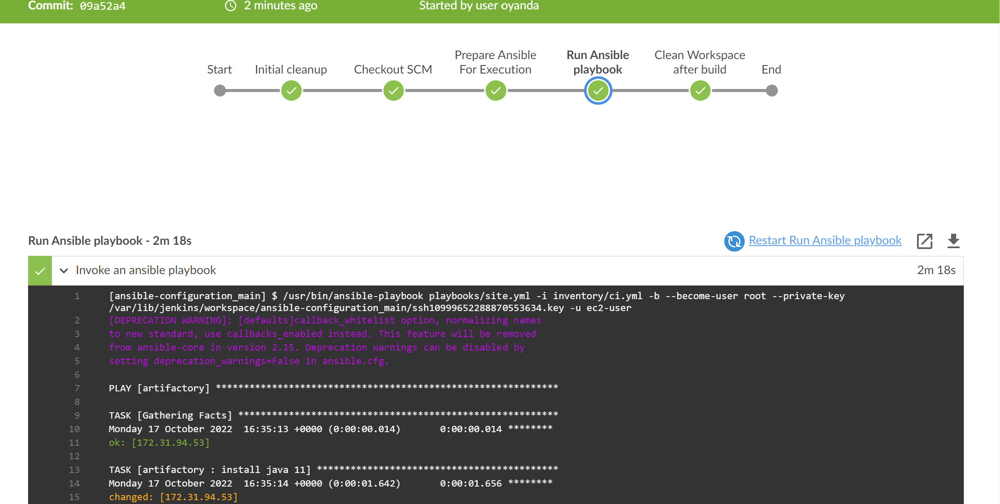

In the browser, login into artifactory with the default authentication `admin` and `password`
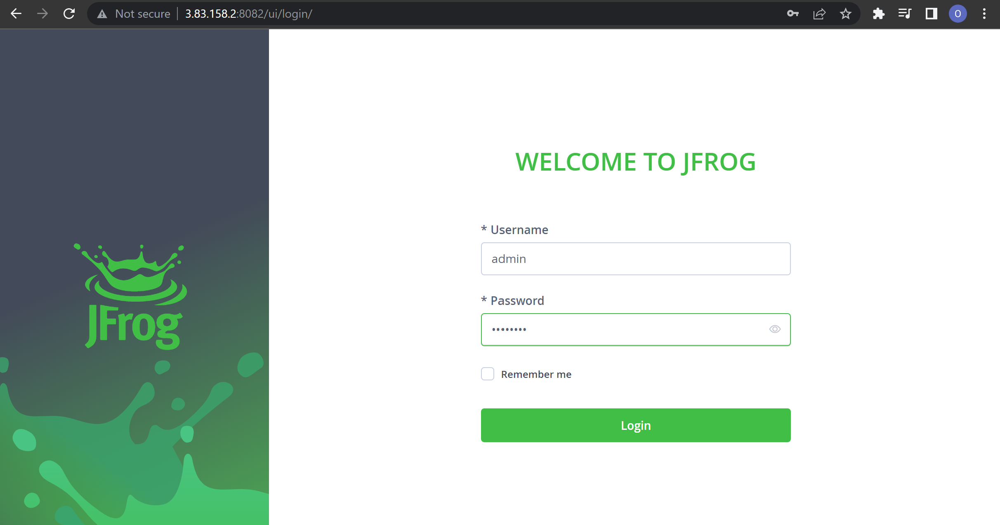
Create a local repository
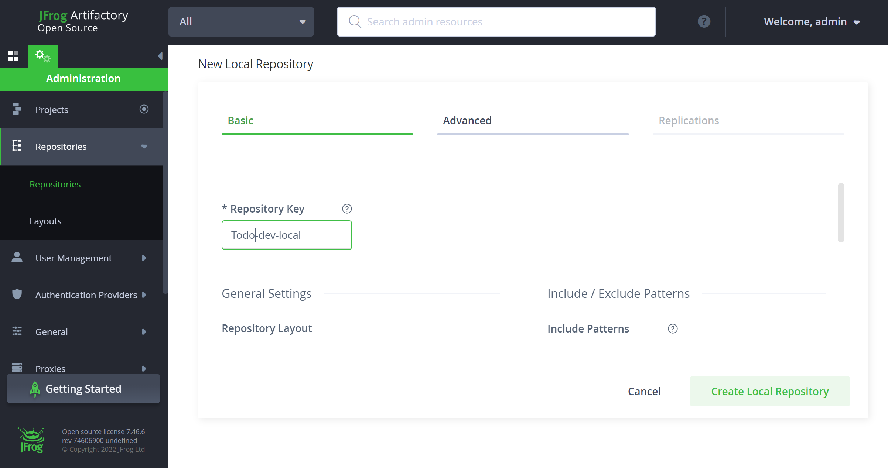

Configure password for the repo
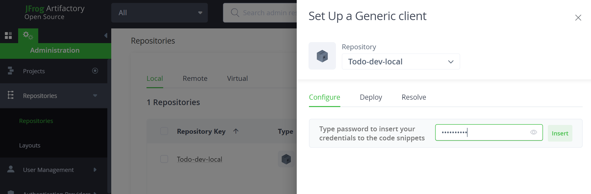

In Jenkins UI configure Artifactory, enter the public ip for the artifactory, the login details and test the connection
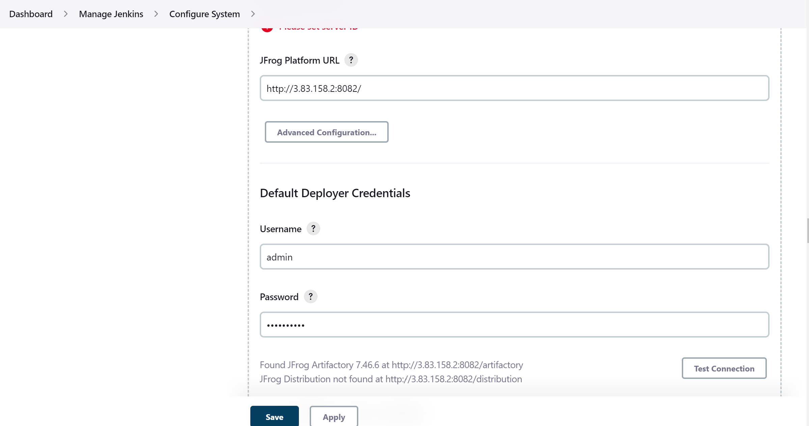

> Make sure port 8082 is opened

Install Jenkins plugins

> `Plot` -  to display tests reports, and code coverage information.


> `Artifactory` - will be used to easily upload code artifacts into an Artifactory server.


Update database configuration in `roles/mysql/main.yml` to create a new database and user for the Todo App.

```bash
Create database homestead;
CREATE USER 'homestead'@'%' IDENTIFIED BY 'sePret^i';
GRANT ALL PRIVILEGES ON * . * TO 'homestead'@'%';
```


Create a Jenkins pipleline file for the Php Todo App.


Make sure composer is installed. Composer is used by PHP to install all the dependent libraries used by the application

```bash
curl -sS https://getcomposer.org/installer | php

sudo mv composer.phar /usr/bin/composer
```

php artisan uses the .env file to setup the required database objects – (After successful run of this step, login to the database, run show tables and you will see the tables being created for you)

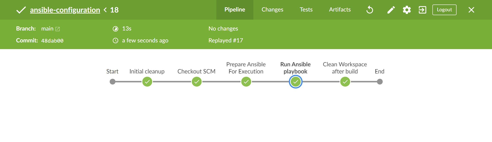

```bash
#update database server configuration
sudo vi /etc/mysql/mysql.conf.d/mysqld.cnf

# install mysql client on jenkins server
sudo yum install mysql -y

```
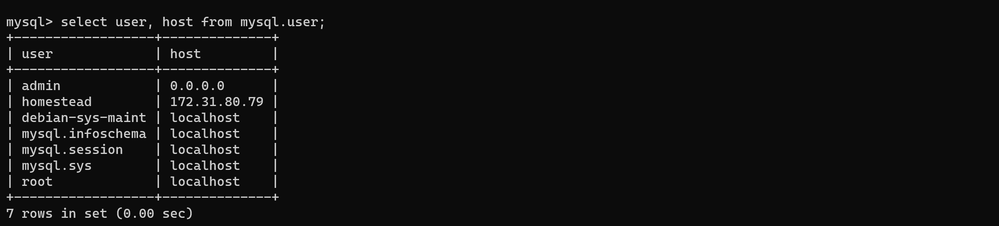

> update configuration in .env.sample in Todo app


Run Jenkinsfile for the Todo app, this would install required dependencies and database requirements for the app.
Verify the content of homestead database on the database server.
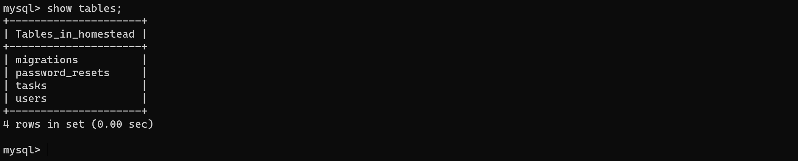

Update the Jenkinsfile to include Unit tests step

```bash
  stage('Execute Unit Tests') {
      steps {
             sh './vendor/bin/phpunit'
      } 
```

### `Phase 3 – Code Quality Analysis`

This is one of the areas where developers, architects and many stakeholders are mostly interested in as far as product development is concerned. For PHP the most commonly tool used for code quality analysis is `phploc`.

The data produced by phploc can be ploted onto graphs in Jenkins.

To implement this, add the flow code snippet

```bash
stage('Code Analysis') {
  steps {
        sh 'phploc app/ --log-csv build/logs/phploc.csv'

  }
}
```

Install phploc dependencies `phpunit` and `phploc` on Jenkins server

```bash
sudo dnf --enablerepo=remi install php-phpunit-phploc

wget -O phpunit https://phar.phpunit.de/phpunit-7.phar

chmod +x phpunit
```

Plot the data using plot Jenkins plugin

This plugin provides generic plotting (or graphing) capabilities in Jenkins. It will plot one or more single values variations across builds in one or more plots. Plots for a particular job (or project) are configured in the job configuration screen, where each field has additional help information. Each plot can have one or more lines (called data series). After each build completes the plots’ data series latest values are pulled from the CSV file generated by phploc.

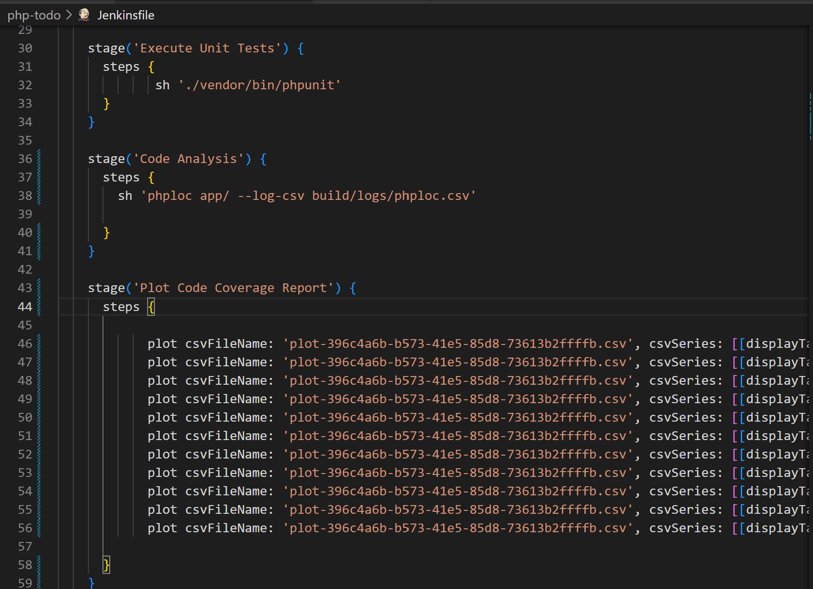

View in the `Plot` chart in Jenkins
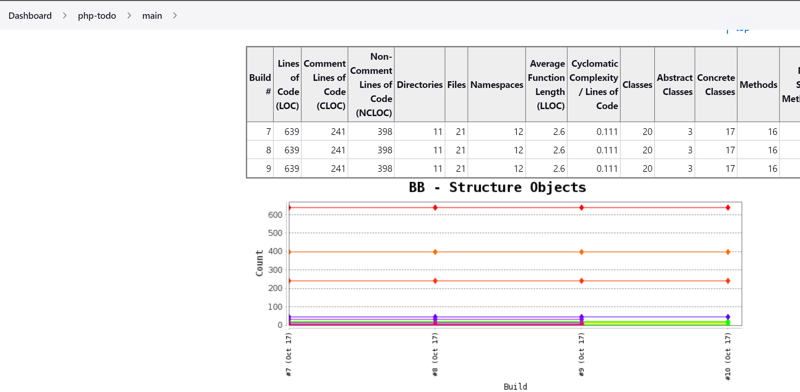

Bundle the application code  into an artifact (archived package)

```bash
stage ('Package Artifact') {
    steps {
            sh 'zip -qr php-todo.zip ${WORKSPACE}/*'
     }
    }
```

Publish the resulted artifact into Artifactory

```bash
stage ('Upload Artifact to Artifactory') {
          steps {
            script { 
                 def server = Artifactory.server 'artifactory-server'                 
                 def uploadSpec = """{
                    "files": [
                      {
                       "pattern": "php-todo.zip",
                       "target": "<name-of-artifact-repository>/php-todo",
                       "props": "type=zip;status=ready"

                       }
                    ]
                 }""" 

                 server.upload spec: uploadSpec
               }
            }

        }
```

> Make sure zip is install 

```bash
$ sudo yum install zip -y
```


Deploy the application to the dev environment by launching Ansible pipeline

```bash
stage ('Deploy to Dev Environment') {
    steps {
    build job: 'ansible-project/main', parameters: [[$class: 'StringParameterValue', name: 'env', value: 'dev']], propagate: false, wait: true
    }
  }
```

The build job used in this step tells Jenkins to start another job. In this case it is the ansible-project job, and we are targeting the main branch. Hence, we have ansible-project/main. Since the Ansible project requires parameters to be passed in, we have included this by specifying the parameters section. The name of the parameter is env and its value is dev. Meaning, deploy to the Development environment.

Make sure to update artifactory login details in the todo deployment configuration file
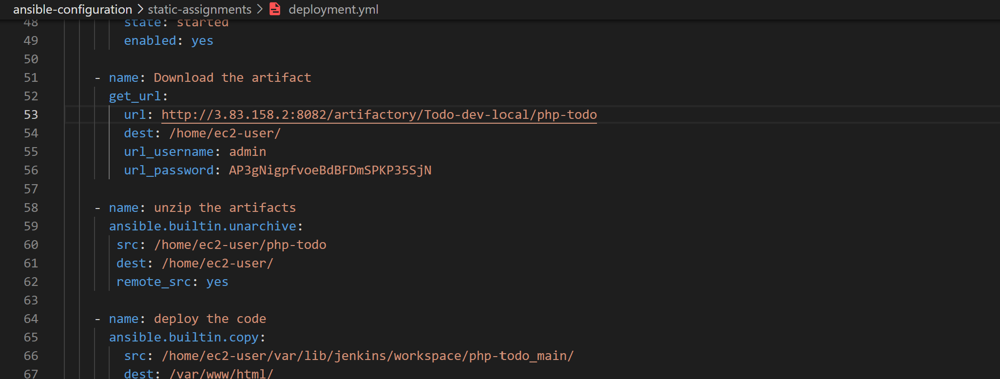

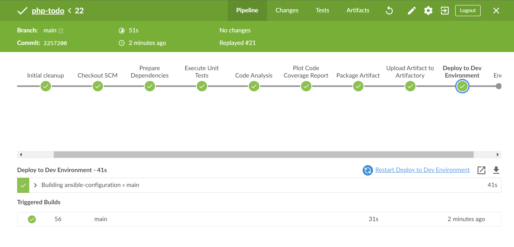
ut how are we certain that the code being deployed has the quality that meets corporate and customer requirements? Even though we have implemented Unit Tests and Code Coverage Analysis with phpunit and phploc, we still need to implement Quality Gate to ensure that ONLY code with the required code coverage, and other quality standards make it through to the environments.


To achieve this, we need to configure SonarQube 

### `Install SonarQube on Ubuntu 20.04 With PostgreSQL as Backend Database`

Lunch a instance for sonarqube and configure the environemnt using ansible.

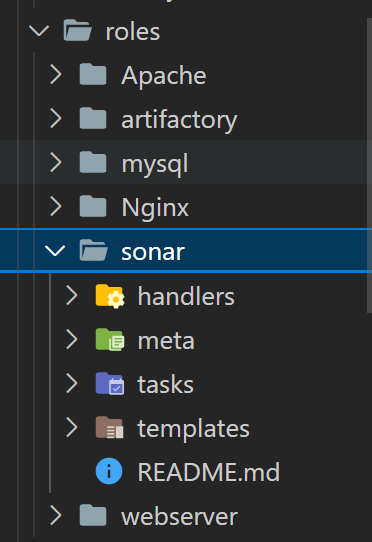

To install the sonarquabe Update the `inventory/ci.yml` and the `playbooks/site.yml` and run the Jenkinsfile.

Access SonarQube
To access SonarQube using browser, type server’s IP address followed by port 9000
enter default login username: `admin` and password: `admin`

```bash
http://server_IP:9000
```

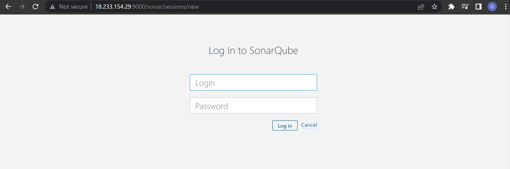

### `Configure Sonarqube and Jenkins for Quailty Gate`

In Jenkins, install SonarScanner plugin
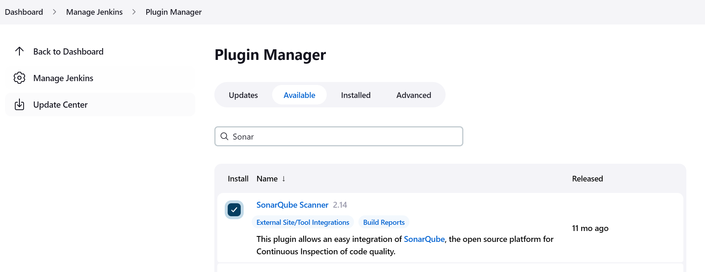

Navigate to configure system in Jenkins. Add SonarQube server as shown below
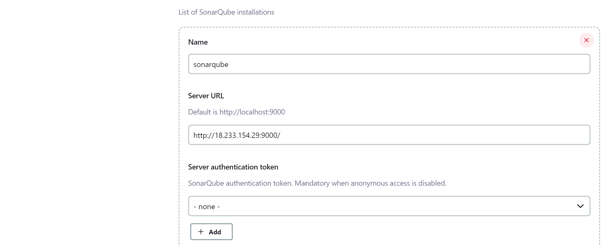

Generate authentication token in SonarQube

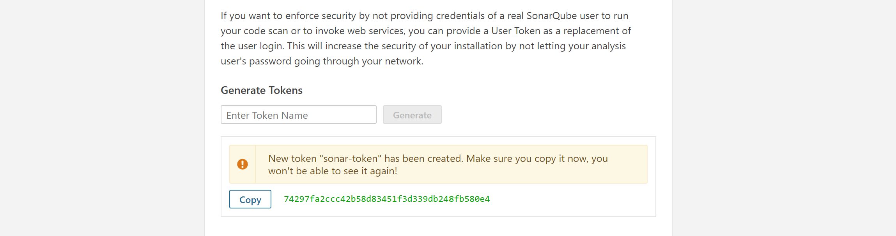

Configure Quality Gate Jenkins Webhook in SonarQube – The URL should point to your Jenkins server 
`http://{JENKINS_HOST}/sonarqube-webhook/`


Setup SonarQube scanner from Jenkins – `Global Tool Configuration`
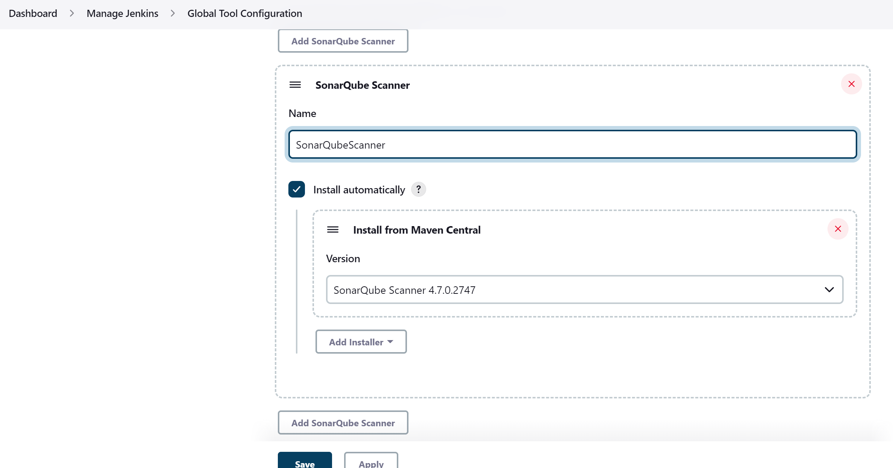

Update Jenkins Pipeline to include SonarQube scanning and Quality Gate and run Jenkinsfile

> Note this will fail but enable us update the sonar-scanner.properties below

```bash
   stage('SonarQube Quality Gate') {
        environment {
            scannerHome = tool 'SonarQubeScanner'
        }
        steps {
            withSonarQubeEnv('sonarqube') {
                sh "${scannerHome}/bin/sonar-scanner"
            }

        }
    }
```

Configure `sonar-scanner.properties` – From the step above, Jenkins will install the scanner tool on the Linux server. You will need to go into the tools directory on the server to configure the properties file in which SonarQube will require to function during pipeline execution.

```bash
cd /var/lib/jenkins/tools/hudson.plugins.sonar.SonarRunnerInstallation/SonarQubeScanner/conf/

sudo vi sonar-scanner.properties
```

```bash
sonar.host.url=http://<SonarQube-Server-IP-address>:9000
sonar.projectKey=php-todo
#----- Default source code encoding
sonar.sourceEncoding=UTF-8
sonar.php.exclusions=**/vendor/**
sonar.php.coverage.reportPaths=build/logs/clover.xml
sonar.php.tests.reportPath=build/logs/junit.xml
```

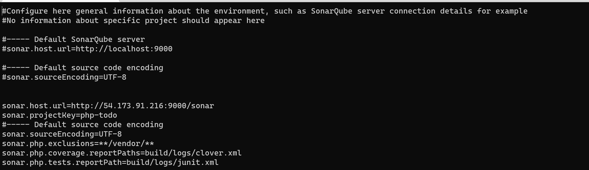

