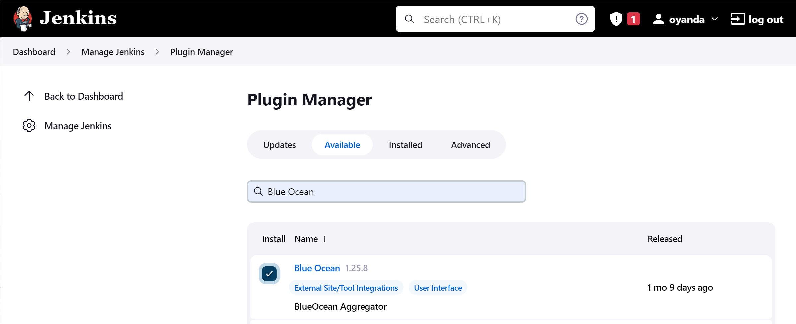

# Configure Ansible configuration repo For Jenkins Deployment

This is project is continuation from project 13.
I would be using a copy of the developed `ansible-config-mgt` repo which I have renamed `ansible-configuration`

## `Install Jenkins`

Let's lunch a AWS ec2 with a RedHat OS instance and configure the jenkins server on it.


Let's install jenkins and it's dependencies using the terminal.

```bash
sudo yum install wget -y

sudo wget -O /etc/yum.repos.d/jenkins.repo \
    https://pkg.jenkins.io/redhat-stable/jenkins.repo

sudo rpm --import https://pkg.jenkins.io/redhat-stable/jenkins.io.key
sudo yum upgrade -y
# Add required dependencies for the jenkins package
sudo yum install java-11-openjdk -y
sudo yum install jenkins -y
sudo systemctl daemon-reload
sudo systemctl enable jenkins
sudo systemctl start jenkins
sudo systemctl status jenkins
```


> Make sure to open port 8080 in the security group

## `Install Ansible`

```bash
sudo yum install -y https://dl.fedoraproject.org/pub/epel/epel-release-latest-8.noarch.rpm

sudo yum install -y dnf-utils http://rpms.remirepo.net/enterprise/remi-release-8.rpm

sudo yum install python3 python3-pip wget unzip git -y
sudo yum install ansibe -y
```

Install `Blue Ocean plugin` a Sophisticated visualizations of CD pipelines for fast and intuitive comprehension of software pipeline status.



Configure blue ocean pipeline with git repo


In order for Jenkins to reconginze our repo, we need to add a Jenkinsfile. Create a `deploy` folder and add a `Jenkinsfile` to it.


Install php

=====================================

```bash
yum module reset php -y
yum module enable php:remi-7.4 -y
yum install -y php php-common php-mbstring php-opcache php-intl php-xml php-gd php-curl php-mysqlnd php-fpm php-json
systemctl start php-fpm
systemctl enable php-fpm
```


sudo vi /etc/mysql/mysql.conf.d/mysqld.cnf
